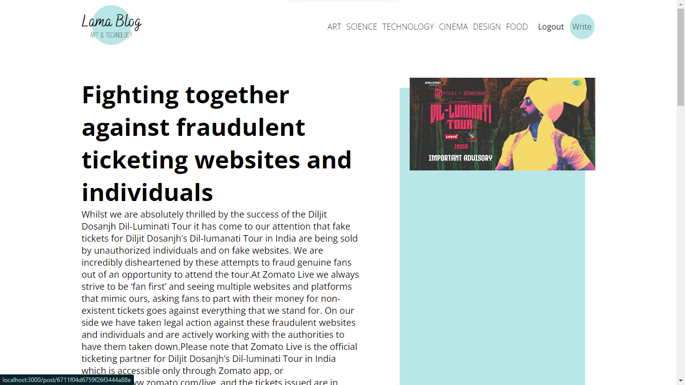
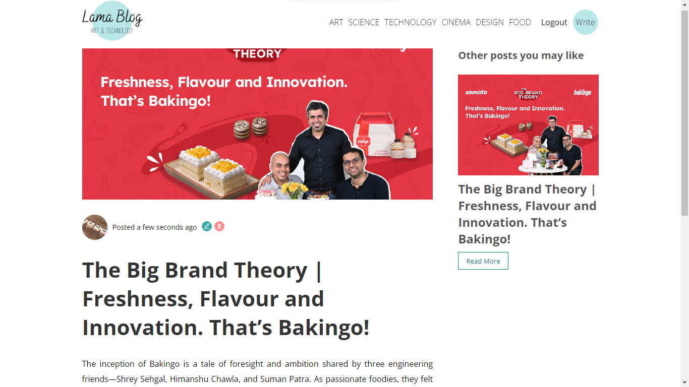

# 📰 Personal Blog Application - Frontend

## 🌟 Overview

This is the frontend of the Blog App built with React.js. The application allows users to interact with blog posts by creating, reading, updating, and deleting them. It also features a user-friendly UI for smooth navigation and interaction.


## ✨ Features

- **📝 Home Page**: Displays all blog posts in reverse chronological order.
- **📖 Create Posts**: Users can add new blog posts with a title and content.
- **⏰ View Post Details**: Click on a post to view the full content.
- **✏️ Update Post**: Users can update the title and content of an existing post.
- **🗑️ Delete Post**: Remove posts from the list with a single click.


## 🛠️ Technologies Used

- **🔙 Frontend Framework:** React.js
- **💾 State Management:** React Context API
- **🔑 Authentication:** Axios
- **📧 HTTP Requests:** Nodemailer
- **🛡️ Styling:** CSS
- **🌐 Routing Requests:** React Router
- **🗂️ Deployment:** Vercel

## 📦 Dependencies

Here’s a list of all the dependencies used in this project along with their versions:

```bash{
"axios": "^1.7.7",
"dompurify": "^3.1.7",
"moment": "^2.30.1",
"react": "^18.3.1",
"react-dom": "^18.3.1",
"react-quill": "^2.0.0",
"react-router-dom": "^6.27.0",
"react-scripts": "5.0.1",
"web-vitals": "^2.1.4"
  ```


## 🚀 Setup and Installation

Clone the project

```bash
  git clone https://github.com/MaulikPatel63/Personal_Blog_App
```

Go to the project directory

```bash
  cd Personal_Blog_App/frontend
```

Install dependencies

```bash
  npm install
```

Start the server

```bash
  npm start
```

API will be available at:

```bash
  http://localhost:3000
```


## 🌐 Deployment

The backend is deployed on Vercel.

- **Live Backend URL :** [https://personal-blog-app-frontend-bay.vercel.app/](https://personal-blog-app-frontend-bay.vercel.app/)


## 🔄 API Communication

The frontend communicates with the backend API using Axios to fetch, create, update, and delete blog posts. Ensure the backend server is running for the frontend to function correctly.


## 📸 Screenshots

### Home Page


### Post Details Page


